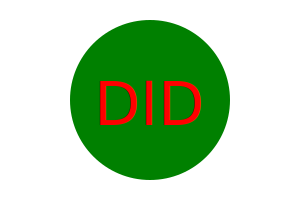

# Logo Generator

### User Story

```md
AS a freelance web developer
I WANT to generate a simple logo for my projects
SO THAT I don't have to pay a graphic designer
```

## Acceptance Criteria

```md
GIVEN a command-line application that accepts user input
WHEN I am prompted for text
THEN I can enter up to three characters
WHEN I am prompted for the text color
THEN I can enter a color keyword (OR a hexadecimal number)
WHEN I am prompted for a shape
THEN I am presented with a list of shapes to choose from: circle, triangle, and square
WHEN I am prompted for the shape's color
THEN I can enter a color keyword (OR a hexadecimal number)
WHEN I have entered input for all the prompts
THEN an SVG file is created named `logo.svg`
AND the output text "Generated logo.svg" is printed in the command line
WHEN I open the `logo.svg` file in a browser
THEN I am shown a 300x200 pixel image that matches the criteria I entered
```

## Description

This project is a Logo Generator that will allow you to generate a logo using the command line and choosing and answering the questions that will be asked. With this files you will be able to run tests and to generate logos according to your choices. This project contains 7 Javascripts files in were 2 of them are test ones.

The biggest challenfe i found was definitly organising everything and know what to do first and what to type first since there was no starter code in this challenge i definitly felt with way higher pressure. Another biggest issue i came across was while i was running the tests finding what was giving the issue and why some tests were not being passed, some of them were pretty simple to fix but the nerves of seeing it fails and getting more nervous definitly made it worse.

This challenge helped me a lot because i was able to work in a more confident way at the end of it, and i started understanding a bit more about javascript since its been one of my biggest struggles. There was some other aspects in where this challenge helped me that i will be listing bellow.

* Higher working speed
* Better understanding of JavaScript
* Better use of inquirer
* Better use of jest

## Table of Contents

- [Installation](#installation)
- [Usage](#usage)
- [Tests](#tests)
- [License](#license)
- [Questions](#questions)

## Installation

To install the necessary dependencies, run the following command:
```
npm i inquirer@8.2.4
npm i -D jest
```

## Usage

So to use this repo is pretty simple. You clone the repo to your local machine, and soon as you open it in your Visual Studio Code you will need to open a terminal. Soon as you have the terminal opel you will need to run the following commands, npm i inquirer@8.2.4 and npm i -D jest. After running this commands you will be able to either run npm test that will test the test files or you can run - node index.js on the terminal that will make the questions to appear. Soon as the questions appear. You will be prompted with 4 questions that you will have to answer, what text you want (maximum 3 digits), the color of the text, what shape you want between (circle, square, triangle) and finally the color of the shape. After answering this 4 questions a logo will be generated and it should be displaying with the options you choosed. If you have any issues in understanding how to use it, you can just watch the video in the last section in where i show how to use it.




## Tests

To run tests, use the following command:
```
npm test
```

## License


This project is licensed under the MIT license.

## Questions

For any questions or inquiries, feel free to reach out to me:
- GitHub: [DiogoS77](https://github.com/DiogoS77)
- Email: diogo.messi.18@hotmail.com
- [Watch the Video](https://drive.google.com/file/d/1cilL14yz4INpE0AiirkJlMNWpNoO-4Ap/view)
